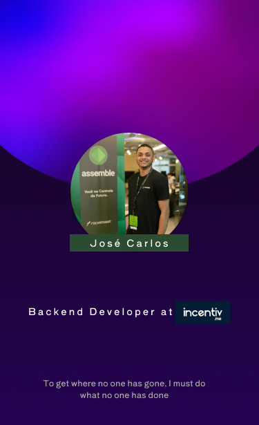

 
<strong>Olá sou José Carlos, desenvolvedor Backend na Incentiv.me</strong>

 

    

  
 
 

 

<h1>Github Status</h1>
 <a href="https://www.github.com/devjosecarlosteles">
  
  

<h1>Minhas formações</h1>

 
  
 

<h1>Contatos</h1>

 
 
 
 
 

<h1>Atividade</h1>
<!-- visitors count  -->

   
    

<!-- github workflow  -->

 

